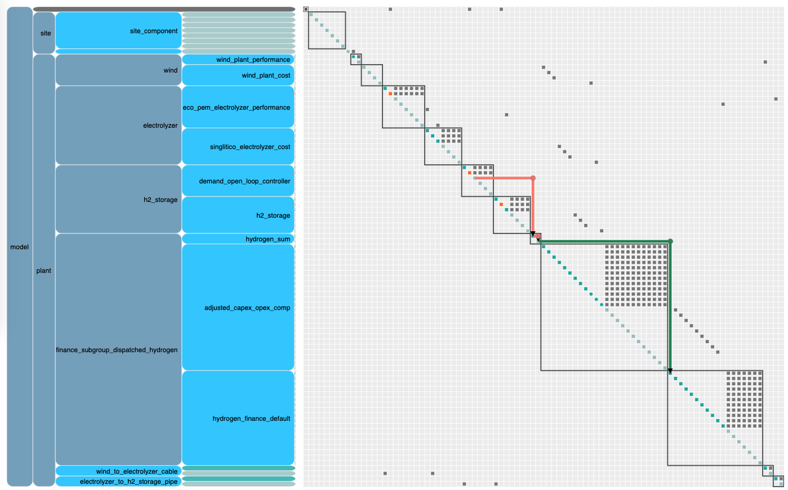
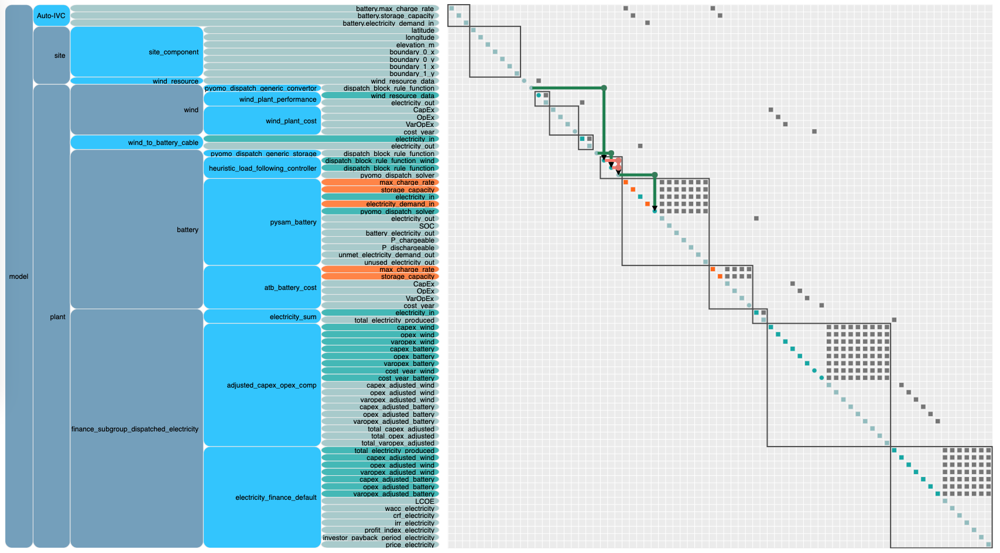

# Control Overview

There are two different systematic approaches, or frameworks, in H2Integrate for control: [open-loop](open-loop control) and [pyomo](pyomo control). These two frameworks are useful in different situations and have different impacts on the system and control strategies that can be implemented. Both control frameworks are focused on dispatching storage technologies and as such can currently only be used on storage technologies. However, we plan to extend them to work more generally as system controllers, and even though the controllers must be placed on storage technologies for now, they behave somewhat like system controllers in that they may curtail/discard commodity amounts exceeding the needs of the storage technology and the specified demand. However, any unused commodity may be connected to another down-stream component to avoid actual curtailment.

(open-loop control)=
## Open-loop control framework
The first, open-loop control, assumes no feedback of any kind to the controller. The open-loop framework does not require a detailed performance model and can essentially act as the performance model in the absence of a dedicated performance model for a given storage technology. The open-loop framework establishes a control component that runs the control and passes out information about storage dispatch, soc, etc.

An example of an N2 diagram for a system using the open-loop control framework for hydrogen storage and dispatch is shown below ([click here for an interactive version](./figures/open-loop-n2.html)).

The open-loop framework currently supports only two control strategy, `pass_through_controller`, and `demand_open_loop_controller`. The `pass_through_controller` simply directly passes the input commodity flow to the output without any modifications. It is useful for testing, as a placeholder for more complex controllers, and for maintaining consistency between controlled and uncontrolled frameworks as this 'controller' does not alter the system output in any way. The `demand_open_loop_controller` uses simple logic to dispatch the storage technology when demand is higher than commodity generation and charges the storage technology when the commodity generation exceeds demand, both cases depending on the storage technology's state of charge. For the `demand_open_loop_controller`, the storage state of charge is an estimate in the control logic and is not informed in any way by the storage technology performance model.

For examples of how to use the open-loop control framework, see the following:
- For the `pass_through_controller`
    - `examples/01_onshore_steel_mn`
    - `examples/02_texas_ammonia`
    - `examples/12_ammonia_synloop`
- For the `demand_open_loop_controller`
    - `examples/14_wind_hydrogen_dispatch/`
    - `examples/19_simple_dispatch/`

(pyomo control)=
## Pyomo control framework
The second systematic control approach, pyomo control, allows for the possibility of feedback control at specified intervals, but can also be used for open-loop control if desired. In the pyomo control framework, each technology can have control rules associated with them that are in turn passed to the pyomo control component, which is owned by the storage technology. The pyomo control component combines the technology rules into a single pyomo model, which is then passed to the storage technology performance model inside a callable dispatch function. The dispatch function also accepts a simulation method from the performance model and iterates between the pyomo model for dispatch commands and the performance simulation function to simulated performance with the specified commands. The dispatch function runs in specified time windows for dispatch and performance until the whole simulation time has been run.

An example of an N2 diagram for a system using the pyomo control framework for hydrogen storage and dispatch is shown below ([click here for an interactive version](./figures/pyomo-n2.html)). Note the control rules being passed to the dispatch component and the dispatch function, containing the full pyomo model, being passed to the performance model for the battery/storage technology. Another important thing to recognize, in contrast to the open-loop control framework, is that the storage technology outputs (commodity out, SOC, unused commodity, etc) are passed out of the performance model when using the Pyomo control framework rather than from the control component.

The pyomo control framework currently supports only a simple heuristic method, `heuristic_load_following_controller`, but we plan to extend the framework to be able to run a full dispatch optimization using a pyomo solver. When using the pyomo framework, a `dispatch_rule_set` for each technology connected to the storage technology must also be specified. These will typically be `pyomo_dispatch_generic_convertor` for generating technologies, and `pyomo_dispatch_generic_storage` for storage technologies. More complex rule sets may be developed as needed.

For an example of how to use the pyomo control framework with the `heuristic_load_following_controller`, see
- `examples/18_pyomo_heuristic_wind_battery_dispatch`
