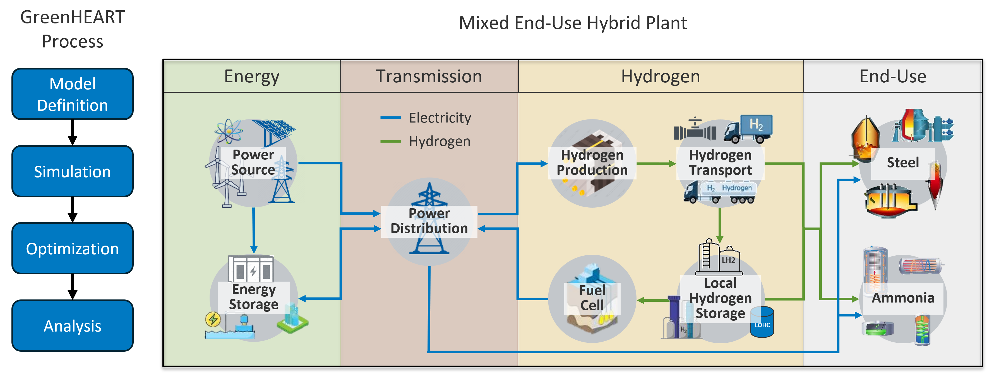

# H2Integrate - Holistic Hybrids Optimization and Design Tool

[](https://badge.fury.io/py/h2integrate)

[](https://pypi.python.org/pypi/h2integrate)
[](https://opensource.org/licenses/BSD-3-Clause)

H2Integrate is an open-source Python package for modeling and designing hybrid energy systems producing electricity, hydrogen, ammonia, steel, and other products.

H2Integrate is designed to be flexible and extensible, allowing users to create their own components and models for various energy systems.
The tool currently includes renewable energy generation, battery storage, hydrogen, ammonia, and steel technologies.
Other elements such as desalination systems, pipelines, compressors, and storage systems can also be included as developed by users.
Some modeling capabilities in H2Integrate are provided by integrating existing tools, such as [HOPP](https://github.com/NREL/HOPP), [PySAM](https://github.com/NREL/pysam), [ORBIT](https://github.com/wisdem/ORBIT), and [ProFAST](https://github.com/NREL/ProFAST).
The H2Integrate tool is built on top of [NASA's OpenMDAO framework](https://github.com/OpenMDAO/OpenMDAO/), which provides a powerful and flexible environment for modeling and optimization.

```{note}
H2Integrate was previously known as GreenHEART. The name was update to H2Integrate to better reflect its expanded capabilities and focus on integrated energy systems.
```

H2Integrate models energy systems on a yearly basis using hourly timesteps (i.e., 8760 operational data points across a year).
Results from these simulations are then processed across the project's lifecycle to provide insights into the system's performance, costs, and financial viability.
Depending on the models used and the size of the system, H2Integrate can simulate systems ranging from the kW to GW scale in seconds on a personal computer.

H2Integrate models hybrid energy systems by:
- Generating electricity output profiles from renewable energy sources (e.g., wind, solar, hydro) and storage systems (e.g., batteries, pumped hydro)
- Modeling the performance of hydrogen electrolyzers, steel furnaces, or ammonia synthesis systems using the generated electricity profiles
- Performing techno-economic analysis of the system to evaluate its costs and financial viability

This process is shown for an example energy system in the figure below:



```{tableofcontents}
```
