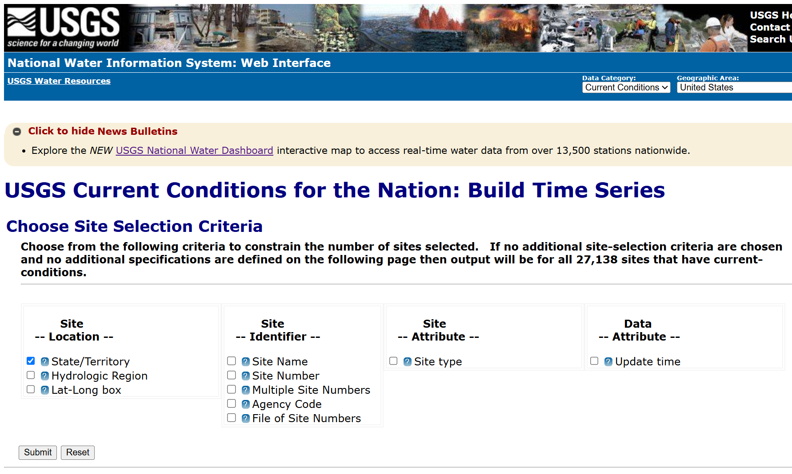
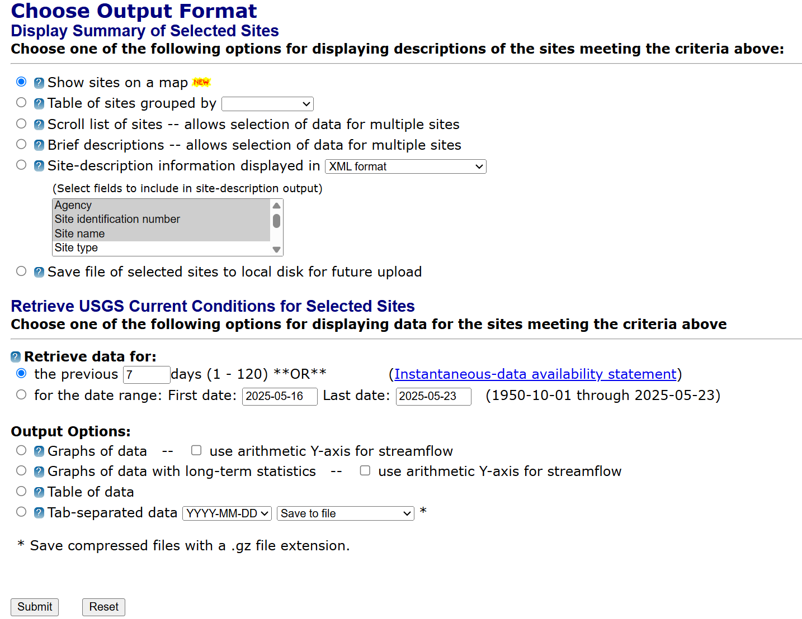
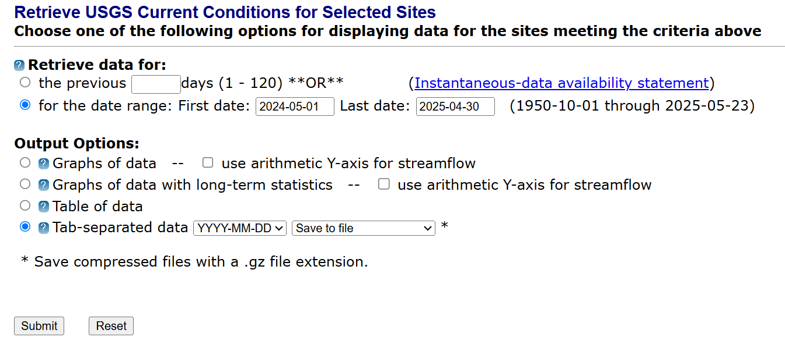

# Run of river hydropower model

The `RunOfRiverHydro` model simulates the generation of electricity from a river generation source (e.g. dam), taking into account the flow rate and the efficiency of the turbine.
The model uses a simple formula to calculate the power generated based on the flow rate and the height difference between the water source and the turbine.
This doc page walks you through how to obtain resource information and how to use the model.

```{note}
This process is quite manual and not as automated as obtaining other resource information.
This is because river information is available at discrete station locations along waterways and each station has different sensor information reported.
```

## Obtaining river resource information

The only river resource information needed is the volumetric discharge of the river.
This can obtained from various sources, but we recommend using the [USGS National Water Information System](https://waterdata.usgs.gov/nwis/rt) for US rivers.
We'll guide you through the process of obtaining the flow rate from the USGS website.

1. Go to the [USGS National Water Information System](https://waterdata.usgs.gov/nwis/uv) website, shown below:

|  |
|-|

   Determine the site number of the river you want to obtain information for.
   You can find the site number by searching for the river name or location on the USGS website.
   Here, we'll select the `State/Territory` option and hit `Submit`.

2. On the next screen, you can select the area of interest.
   For this example, we'll select Kansas then scroll to the bottom of the page and select `Show sites on a map` then `Submit`.
   This will show you a map of the sites in Kansas.

|  |
|-|

|  |
|-|

3. This brings us to a map of the sites in Kansas.
   You can zoom in and out to find the site you're interested in.
   For this example, we'll select the `KANSAS R AT DESOTO, KS` site as shown in the image below.
   This gives us the site number `06892350` which we will use to download the relevant river data.

|  |
|-|

4. Next, return to the [USGS National Water Information System homepage](https://waterdata.usgs.gov/nwis/uv) and select the `Site Number` option then hit `Submit`.
   On the next screen, enter the site number `06892350` as shown below then scroll to the bottom of the page.

|  |
|-|

```{note}
Not all sites include discharge data.
Please check the site information to ensure that the site you selected has discharge data (in cubic feet per second) available.
```

5. Now you can select the date range that you're interested in.
   H2Integrate requires exactly one year of data, so you can select the start and end dates accordingly.
   In this example, we select the start date as `2024-05-01` and the end date as `2025-04-30`.
   Then, select the `Tab-separated data` option and hit `Submit`.
   This will download a file with the river data in tab-separated format.
   Rename this file to have a `.csv` extension for use in H2Integrate.

|  |
|-|

## Using the downloaded river data

Now that you have the river data, you can use it in H2Integrate.
Follow the `07_run_of_river_plant` example script and yaml files to see how to use the river data in H2Integrate.

You will need to specify the path to the downloaded river data file in the `plant_config` yaml and also specify the resource being used for the river technology model in the `tech_config` yaml.
Also within the `tech_config` yaml, you can set the performance and cost parameters for the hydroelectric plant.
